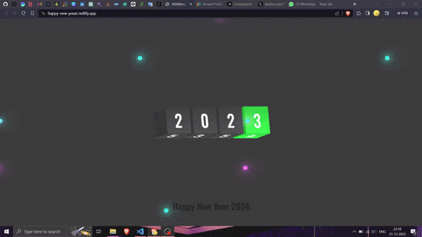

# Happy New Year Animation Effect 2024

## Project Overview

Celebrate the arrival of the year 2024 with style! The **Happy New Year Animation Effect** project brings a visually appealing and interactive animation to your web page. Created using HTML, CSS, and JavaScript, this project aims to add a touch of festivity and joy to your digital space.

## Preview -



## Description

As the year turns, it's time to usher in the New Year with a captivating animation that engages and delights. This project features a combination of rotating texts and glowing spheres, creating an immersive experience for anyone who encounters it.

### Key Features

- **Eye-catching Animation:** The main attraction is the mesmerizing rotation of New Year digits, providing a dynamic and visually striking element.
  
- **Interactive Greeting:** Click on the "Happy New Year" text to trigger a special animation effect, adding an interactive element to the celebration.

- **Festive Glowing Spheres:** The glowing spheres add a festive and magical touch to the overall presentation, creating a sense of joy and wonder.

### How to Use

1. **Clone the Repository:**
   ```bash
   git clone https://github.com/StarKnightt/Happy-New-Year-2024
```
2. Open in browser

   Open the index.html file in your web browser to experience the New Year animation.

3. Click to celebrate

  Click on the "Happy New Year" text to activate a special animation, adding an extra layer of excitement.

``````


##  Customization
Feel free to customize the project to match your preferences or integrate it into your own web projects. Here are some customization options:

- Color Scheme : Modify colors in the CSS file (style.css) to match your preferred color palette.

- Text Content : Personalize the New Year message by updating the text content and styling in the HTML file (index.html).

- Animation Duration : Adjust the duration and timing of animations by modifying the transition and animation properties in the CSS file.

## Responsiveness

The project has been designed with responsiveness in mind. The layout and design adapt to different screen sizes, providing a seamless experience across devices


## HAPPY NEW YEAR

May this New Year bring joy, prosperity, and success to you and your loved ones. Happy coding and Happy New Year!